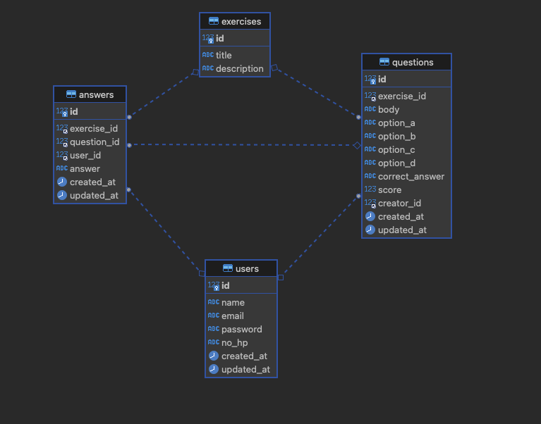

# rest-api-c6
Homework for Building RESTful API Golang Batch 6

## Package
- Database
    - [gorm](https://gorm.io/)
- Routing framework
    - [gin gonic](https://gin-gonic.com/)

## Dependencies
- mysql
- golang

## API Documentation
can check this  using [swagger](https://editor.swagger.io/) 

## API
- create register user
- create exercise
- display exercise question
- calculate score
- create question
- create answer

## DB Schema

